# CeloRefer

<div align="center">


### We're not only building on Celo, we're building FOR Celo, using the Celo ecosystem.

**The first decentralized referral and reputation protocol for Celo.**

Turn every user into an ambassador. Track referrals on-chain. Reward growth automatically.

[](https://opensource.org/licenses/MIT)
[](https://www.npmjs.com/package/celorefer-sdk)

[Demo](#) • [Documentation](https://celoref.mintlify.app/api-reference/introduction) • [npm Package](https://www.npmjs.com/package/celorefer-sdk)

</div>

---

## 🔥 The Problem & Why Celo Needs This

### Web3 Growth is Broken

Current challenges in the Celo ecosystem:
- ❌ **No on-chain referral tracking** - dApps can't verify who referred whom
- ❌ **Centralized solutions** - Traditional referral systems are gameable and off-chain
- ❌ **Zero recognition** - Users get no credit for community building efforts
- ❌ **Missing identity layer** - No verifiable reputation system across Celo

### Why Existing Solutions Fall Short

- **Attrace, Layer3** - Not on Celo, focus only on quests
- **Galxe** - Centralized points system, no phone-based identity
- **Traditional affiliate tools** - Off-chain tracking, no crypto rewards

### The Celo Opportunity

Celo has **3M+ MiniPay users** with phone numbers already mapped to wallets via **SocialConnect** — but **zero infrastructure** to leverage this for growth.

**What makes Celo uniquely positioned:**
- ✅ **SocialConnect integration** - Phone number = wallet address
- ✅ **Real-world identity** - Users have verified phone numbers  
- ✅ **Mobile-first ecosystem** - 3M+ MiniPay users ready to refer
- ✅ **Stablecoin economy** - Easy to reward in cUSD/USDC

**This protocol unlocks:**
- 📱 **Phone-based viral loops** - Share referral links via WhatsApp/SMS
- 🏆 **On-chain reputation** - Portable, verifiable across all Celo dApps
- 💰 **Automated crypto rewards** - 5-25% commission based on performance tier
- 🔌 **Universal SDK** - Any dApp can integrate in < 30 lines of code

---

## 🎯 What We've Built

**CeloRefer** is a complete decentralized referral and reputation infrastructure for the Celo blockchain. It consists of:

### Core Components

1. **Smart Contracts** (Solidity)
   - `CeloReferEnhanced.sol` - Main referral logic with quest & season systems
   - `ReputationNFT.sol` - Soulbound NFTs with dynamic metadata
   - `DemoDApp.sol` - Example integration for testing

2. **TypeScript SDK** (`celorefer-sdk`)
   - 70+ methods covering all protocol features
   - Type-safe viem-based blockchain interactions
   - Published on npm, production-ready

3. **Frontend Demo** (Next.js + Tailwind)
   - User dashboard with referral tracking
   - Quest progress & seasonal leaderboards
   - NFT reputation display

4. **Comprehensive Documentation**
   - Full API reference: https://celoref.mintlify.app
   - Integration guides for developers
   - Platform workflow documentation

### Key Features

The CeloRefer SDK simplifies building decentralized referral programs on Celo:

- **User Management** - Registration with referral codes, profile management
- **Tiered Badge System** - Dynamic rewards (Bronze → Silver → Gold → Platinum)
- **Gamification Engine** - Quests, milestones, seasonal competitions
- **Reputation NFTs** - Soulbound tokens reflecting on-chain achievements
- **Partner Integration** - Subscription system for dApp monetization
- **Leaderboard** - Real-time rankings and social proof

**Result:** Create viral growth loops powered by crypto incentives

---

## 🏗️ System Architecture

```mermaid
flowchart TD
    subgraph "Client Layer"
        A[Frontend dApp]
        B[CeloRefer SDK TypeScript]
    end
    
    subgraph "Smart Contract Layer"
        C[CeloReferEnhanced Contract]
        D[ReputationNFT Contract]
        E[cUSD Token]
    end
    
    subgraph "Data Layer"
        F[User Profiles & Referral Graph]
        G[Quest & Season State]
        H[Badge Tiers & Reward Rates]
        I[Partner Subscriptions]
    end
    
    A --> B
    B --> C
    B --> D
    B --> E
    
    C --> F
    C --> G
    C --> H
    C --> I
    
    D -.queries stats.-> C
    F -.determines.-> H
    G -.leverages.-> F
    
    style B fill:#ffd700
    style C fill:#6366f1
    style D fill:#8b5cf6
```



### How It Works

1. **User Registration** → SDK calls `CeloReferEnhanced.register(referralCode)`
2. **Referral Tracking** → Parent and grandparent referrers stored on-chain
3. **Action Recording** → Partner dApps call `recordActionAndDistributeRewards()`
4. **Automatic Rewards** → Smart contract calculates tier-based % and distributes cUSD
5. **Tier Progression** → Badge tier updates automatically based on referral count
6. **NFT Updates** → Reputation NFT metadata updates dynamically via on-chain queries
7. **Gamification** → Quests and seasons create competition and bonus rewards

---

## ✨ Core Features

### 1. Multi-Level Referral System
- **2-level referral tree** (direct referrer + grandparent)
- **Dynamic reward rates** based on badge tier:
  - Bronze: 5% L1 / 2% L2
  - Silver: 6% L1 / 2.5% L2
  - Gold: 7% L1 / 3% L2
  - Platinum: 8% L1 / 3.5% L2
- **Automatic distribution** in cUSD on every tracked action

### 2. Badge & Reputation System
- **4 tiers** with increasing benefits:
  - 🥉 **Bronze** (0+ referrals)
  - 🥈 **Silver** (5+ referrals)
  - 🥇 **Gold** (15+ referrals)
  - 💎 **Platinum** (50+ referrals)
- **Portable reputation** across all Celo dApps
- **Soulbound NFTs** with dynamic on-chain metadata

### 3. Quest System
- **Gamified milestones** (e.g., "Refer 5 users → 100 cUSD")
- **Progress tracking** for each user
- **On-chain reward claims** with validation
- **Quest activation/deactivation** by admin

### 4. Seasonal Competitions
- **Time-bound leaderboards** with prize pools
- **Top performer rewards** distributed automatically
- **Multiple seasons** running concurrently
- **User season stats** tracked separately

### 5. Partner Integration
- **Subscription tiers** for dApp partners
- **Custom reward configurations** per partner
- **Authorization system** for action recording
- **15% platform fee** supports protocol sustainability

### 6. SocialConnect Ready
- **Phone number identity** integration (SocialConnect compatible)
- **Mobile-first** user experience
- **WhatsApp/SMS** referral sharing
- **Simplified onboarding** for non-crypto users

---

## 🧪 SDK Testing & Validation

We've built a comprehensive test suite to prove the SDK works with live blockchain contracts.

### Run Tests

```bash
cd packages/celorefer-sdk
npm install
npm run validate
```

### Test Coverage

✅ **31/34 tests passing** (3 skipped due to uninitialized features)

**Tested Modules:**
- ✅ User Management (5 tests)
- ✅ Badge System (5 tests)
- ✅ Reward Rates (2 tests)
- ✅ Quest System (4 tests)
- ✅ Season System (3 tests)
- ✅ NFT System (4 tests)
- ✅ Partner Integration (4 tests)
- ✅ Token Operations (1 test)
- ✅ Leaderboard (3 tests)

**Live Smart Contracts on Celo Sepolia:**
- CeloReferEnhanced: [`0xCCAd...Ea73`](https://alfajores.celoscan.io/address/0xCCAddAC9Ac91D548ada36684dB2b3796A0c7Ea73)
- ReputationNFT: [`0xe667...E37b`](https://alfajores.celoscan.io/address/0xe667437aF0424Ee9cb983b755Ccccf218779E37b)

---

## 🚀 Quick Start

### For dApp Developers

```bash
npm install celorefer-sdk viem
```

```typescript
import { CeloReferSDK } from 'celorefer-sdk';
import { createWalletClient, http } from 'viem';
import { celoAlfajores } from 'viem/chains';

const walletClient = createWalletClient({
  chain: celoAlfajores,
  transport: http(),
});

const sdk = CeloReferSDK.create(celoAlfajores, walletClient);

// Register user with referral code
await sdk.registerUser('REF123ABC');

// Get user's badge tier and stats
const userInfo = await sdk.getUserInfo(userAddress);
console.log(`Tier: ${userInfo.badgeTier}`);
console.log(`Referrals: ${userInfo.stats.referralCount}`);
```

### For Frontend Integration

See the [`frontend/`](./frontend) directory for a complete Next.js example with:
- Wallet connection (RainbowKit/wagmi)
- User registration flow
- Referral dashboard
- Quest tracking UI
- Leaderboard display

---

## 📦 Repository Structure

```
celo-hackathon/
├── src/                      # Smart contracts (Solidity)
│   ├── CeloReferEnhanced.sol # Main referral contract
│   ├── ReputationNFT.sol     # NFT reputation system
│   └── DemoDApp.sol          # Example integration
├── packages/
│   └── celorefer-sdk/        # TypeScript SDK (published on npm)
│       ├── src/              # SDK source code
│       ├── validate-sdk.ts   # Comprehensive test suite
│       └── README.md         # SDK documentation
├── frontend/                 # Next.js demo application
│   ├── src/app/              # App router pages
│   └── src/components/       # React components
├── docs/                     # Mintlify documentation
├── script/                   # Foundry deployment scripts
└── test/                     # Smart contract tests (Foundry)
```

---

## 🛠️ Technologies Used

### Smart Contracts
- **Solidity 0.8.20** - Contract language
- **Foundry** - Development framework
- **OpenZeppelin** - Security-audited contracts

### SDK & Frontend
- **TypeScript** - Type-safe development
- **viem** - Modern Ethereum library
- **Next.js 14** - React framework
- **Tailwind CSS** - Styling
- **RainbowKit** - Wallet connection

### Infrastructure
- **Celo Sepolia** - Testnet deployment
- **Mintlify** - Documentation hosting
- **npm** - Package distribution

---

## 📚 Documentation

- **Full API Reference:** https://celoref.mintlify.app/api-reference/introduction
- **SDK README:** [packages/celorefer-sdk/README.md](./packages/celorefer-sdk/README.md)
- **Integration Guides:** Available in docs folder
- **Contract Documentation:** See Solidity NatSpec comments

---

## 🤝 For Hackathon Judges

### Key Evaluation Points

1. **✅ Technical Complexity**
   - Multi-level referral tree with dynamic reward rates
   - Soulbound NFTs with dynamic on-chain metadata
   - Quest and season systems with state management
   - Comprehensive SDK with 70+ methods

2. **✅ Celo Integration**
   - SocialConnect-ready for phone-based identity
   - cUSD for stablecoin rewards
   - Deployed on Celo Sepolia testnet
   - Designed specifically for Celo's mobile-first ecosystem

3. **✅ Practical Use Case**
   - Solves real growth problem for Celo dApps
   - Works with existing 3M+ MiniPay users
   - Immediate integration path for partners
   - Sustainable monetization model (15% platform fee)

4. **✅ Code Quality**
   - 31/34 SDK tests passing
   - Published npm package (production-ready)
   - Comprehensive documentation
   - Clean, modular architecture

### How to Validate

```bash
# 1. Clone repository
git clone <repo-url>
cd celo-hackathon

# 2. Test SDK
cd packages/celorefer-sdk
npm install
npm run validate

# 3. View contracts on explorer
open https://alfajores.celoscan.io/address/0xCCAddAC9Ac91D548ada36684dB2b3796A0c7Ea73

# 4. Check npm package
open https://www.npmjs.com/package/celorefer-sdk

# 5. Browse documentation
open https://celoref.mintlify.app
```

---

## 🎯 Future Roadmap

- [ ] Deploy to Celo Mainnet
- [ ] Integrate full SocialConnect attestation
- [ ] Build subgraph for efficient leaderboard queries
- [ ] Add more quest types and automation
- [ ] Partner onboarding dashboard
- [ ] Mobile app (React Native)
- [ ] Cross-chain reputation bridging

---

## 📄 License

MIT License - see [LICENSE](LICENSE) file for details

---

## 🌟 Built For Celo

This project leverages Celo's unique advantages:
- 💰 **Stable rewards** via cUSD
- 📱 **Mobile-native** integration
- 🔗 **SocialConnect** for identity
- ⚡ **Fast & cheap** transactions
- 🌍 **Real-world** use cases

---

<div align="center">

**Built with ❤️ for the Celo ecosystem**

[Demo](#) • [Documentation](https://celoref.mintlify.app/api-reference/introduction) • [npm Package](https://www.npmjs.com/package/celorefer-sdk)

</div>
